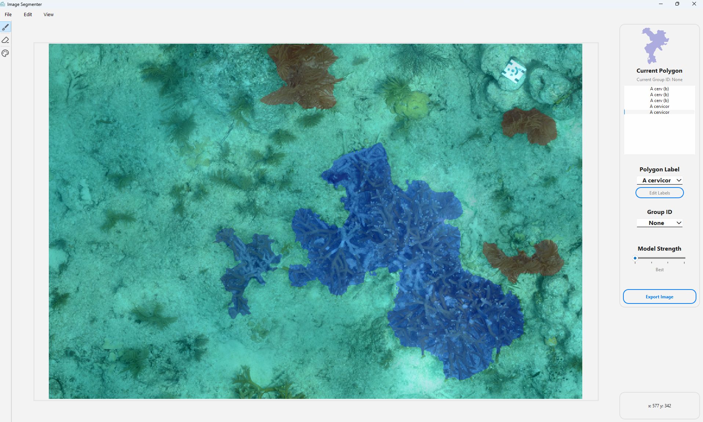
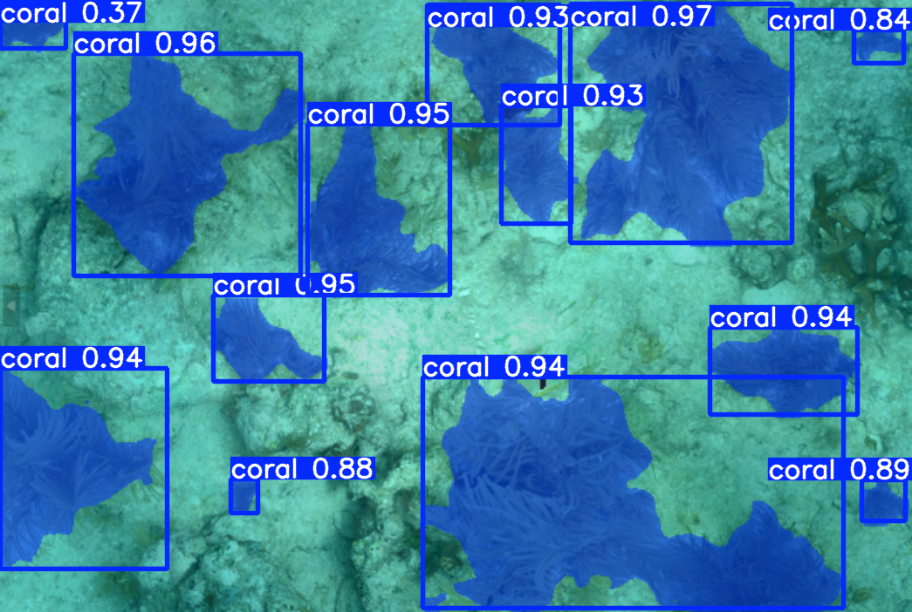

# Segmentation Painter

Segmentation Painter is an image annotation tool built for fast, precise segmentation on large scientific imagery. It provides an interactive UI for creating
segmentation masks, exporting data, and supporting downstream computer vision workflows. The tool was designed specifically for large-scale coral annotation on marine orthosmosaics, but can be used
with any image.



## Overview

Segmentation Painter implements Meta's Segment Anything Model (SAM) to accelerate annotation on high-resolution imagery, such as TIFF files. Users can click on
objects of interest to generate segmentation masks. Additional functionality includes refining annotations using positive/negative points, and assigning labels to annotations.

Key features:
- High-resolution image loading with pan/zoom controls
- SAM-powered segmentation with interactive refinements
- Support for TIFF file format
- Object labeling for classification tasks
- Undo/redo functionality
- Shapefile export compatible with tools like QGIS and ArcGIS
- Re-loadable project states using shapefiles
- Optional group ID assignment for clustering related annotations

## Downstream Tasks

Segmentation Paper has been used to annotate coral segmentation datasets, allowing for custom segmentation models as seen below.




User feedback from marine researchers drove several improvements, including:
- Moving from a custom single-file project format to separate shapefile outputs for compatibility
- Storing metadata in shapefiles, including labels and positioning
- Better trasnferability to GIS tools


## Project Setup

1. Clone the repository
   ```sh
   git clone https://github.com/JoeWilder/SegmentationPainter.git
   ```
2. Install dependencies
   ```sh
   pip install -r requirements.txt
   ```
4. Run the project
   ```sh
   python main.py
   ```
